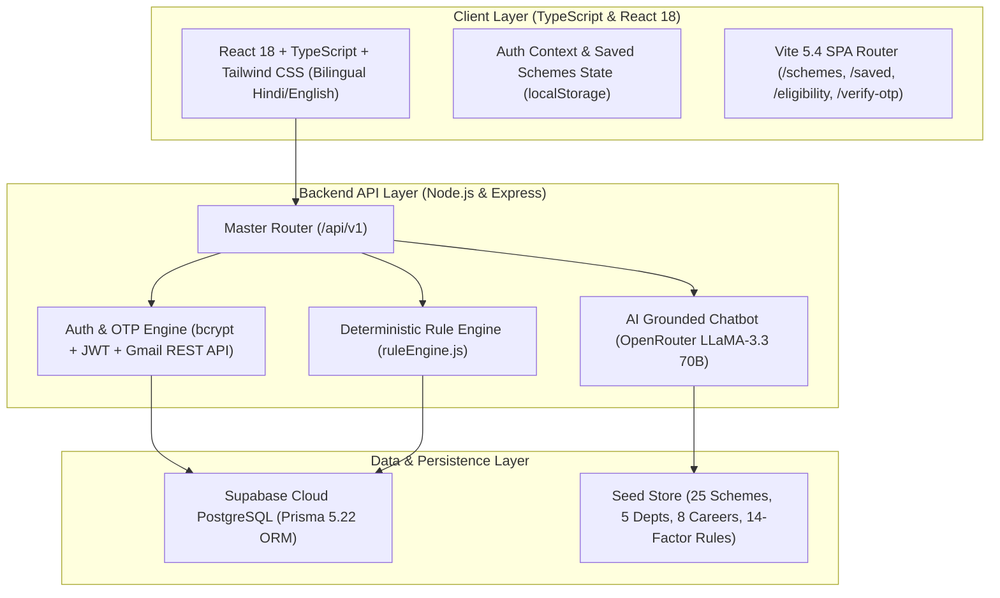

# Bihar Sahayak (BSeva) 🇮🇳
### **AI-Powered Government Scheme & Career Intelligence Platform for Bihar**
> **Discover. Understand. Decide. Connect.**  
> *बिहार के नागरिकों, विद्यार्थियों, किसानों एवं युवाओं के लिए सरकारी योजनाओं एवं करियर अवसरों का डिजिटल मार्गदर्शक।*

---

[](https://biharskill.vercel.app)
[](https://bseva.onrender.com/api/v1/health)
[](https://opensource.org/licenses/ISC)
[](https://www.typescriptlang.org/)
[](https://supabase.com)
[](https://prisma.io)
[](https://nodejs.org)
[](https://reactjs.org)
[](https://vitejs.dev/)
[](https://tailwindcss.com)
[]()

---

## 📌 Table of Contents
- [Executive Overview](#-executive-overview)
- [System Architecture](#-system-architecture)
- [Deterministic 14-Factor Eligibility Rule Engine](#-deterministic-14-factor-eligibility-rule-engine)
- [Grounded AI Assistance (OpenRouter RAG)](#-grounded-ai-assistance-openrouter-rag)
- [Email OTP Authentication](#-email-otp-authentication)
- [Core Features & Modules](#-core-features--modules)
- [Project Folder Structure](#-project-folder-structure)
- [Quick Start Guide](#-quick-start-guide)
- [Official Disclaimer](#-official-disclaimer)

---

## 🚀 Executive Overview

**Bihar Sahayak (BSeva)** is a modern GovTech discovery and intelligence platform designed to eliminate information asymmetry across Bihar's public welfare ecosystem.

Rather than replacing official government websites, Bihar Sahayak serves as a **smart navigation and eligibility layer** that guides citizens directly to the right official departments, document checklists, and application portals.

```
┌─────────────────┐       ┌────────────────────────┐       ┌──────────────────────┐
│  Citizen Input  │  ──►  │   BSeva Intelligence   │  ──►  │ Official Govt Portal │
│ (Profile/Need)  │       │ (Eligibility + Skills) │       │ (ServicePlus / DBT)  │
└─────────────────┘       └────────────────────────┘       └──────────────────────┘
```

### Core Design Principles:
1. **Hindi-First & Simple UX:** Easy language with a 1-click `हिंदी / English` toggle for rural and semi-urban accessibility.
2. **Deterministic Rule Engine First:** Eligibility is computed via strict logical rules, eliminating AI hallucinations.
3. **100% Type-Safe Architecture:** Frontend written in **TypeScript 5.7 (`.tsx` / `.ts`)** with strict interfaces matching backend Prisma data contracts.
4. **Grounded Information:** Every scheme links directly to verified departmental portals (*ServicePlus, DBT Agriculture, MedhaSoft, BSDM*).
5. **Privacy-by-Design:** No collection of Aadhaar numbers or banking credentials during scheme discovery.

---

## 🏗️ System Architecture



---

## 🎯 Deterministic 14-Factor Eligibility Rule Engine

Unlike standard search systems that return generic recommendations, BSeva evaluates eligibility across **14 real-world criteria**:

| Category | Profile Factor | Real-World Bihar Scheme Impact |
|---|---|---|
| **Demographics** | `age`, `gender`, `isBiharResident` | Minimum age constraints, women-specific schemes (*Kanya Utthan*) |
| **Social & Economic** | `socialCategory`, `annualIncome`, `maritalStatus` | Caste quotas (SC/ST/EBC/OBC), poverty line thresholds, widow pensions (*Laxmibai Pension*) |
| **Education & Youth** | `education`, `employmentStatus` | Student credit cards vs. unemployed allowances (*Swayam Sahayata Bhatta*) |
| **Agriculture** | `landHoldingAcres`, `farmerType` | Distinguishes land-owning farmers from sharecroppers (*बटाईदार*) (*PM-KISAN, Fasal Sahayata*) |
| **Welfare & Domicile** | `rationCardType`, `areaType` | BPL prioritization, rural panchayat criteria (*Gram Parivahan Yojana*) |
| **Compliance & Tax** | `isIncomeTaxPayer`, `hasGovtEmployeeInFamily` | Exclusion filters for pensions and agricultural grants |
| **Direct Benefits** | `isAadhaarDbtLinked` | Pre-checks bank account seeding (*MedhaSoft, e-Kalyan, DBT Agriculture*) |
| **Merit & Specialty** | `hasClearedPrelims`, `hasFisheryPond`, `isMigrantWorker`, `isSportsMedalist` | *Civil Seva Protsahan (₹1 Lakh reward)*, *Matsya Palan*, *Pravasi Mazdoor Anudan*, *Khel Vikas* |

---

## 🤖 Grounded AI Assistance (OpenRouter RAG)

The AI chatbot uses **Retrieval-Augmented Generation (RAG)** powered by OpenRouter's `meta-llama/llama-3.3-70b-instruct:free`:
- Ingests verified scheme parameters and official government guidelines.
- Strictly provides factual answers with official portal links.
- Supports both Hindi and English citizen inquiries.

---

## 📧 Email OTP Authentication

1. **Step 1 (`/register`)**: Citizen enters Name, Mobile, Email, and Password ➔ System sends a secure 6-digit OTP to their Gmail address.
2. **Step 2 (`/verify-otp`)**: Citizen verifies the 6-digit OTP code ➔ Account is verified in Supabase PostgreSQL and authenticated via JWT.

---

## 📂 Project Folder Structure

```
BiharAi/
├── frontend/                  # React 18 + TypeScript + Vite 5.4 + Tailwind CSS
│   ├── src/
│   │   ├── components/       # Common UI, Navbar, SearchAutocomplete, AiChatWidget
│   │   ├── context/          # AuthContext, SavedSchemesContext
│   │   ├── pages/            # HomePage, SchemesPage, EligibilityCheckerPage, VerifyOtpPage
│   │   ├── services/         # api.ts (Axios client with dynamic baseURL)
│   │   └── types/            # TypeScript data contracts & interfaces
│   └── public/               # Static assets & Bihar heritage spotlight cards
├── backend/                   # Node.js + Express + Prisma ORM API
│   ├── prisma/               # schema.prisma (PostgreSQL models) & seed.js
│   ├── src/
│   │   ├── modules/          # auth, eligibility, schemes, careers, ai, admin
│   │   ├── services/         # email.service.js (Gmail REST API + SMTP)
│   │   ├── database/         # db.js (Supabase client) & seedLoader.js
│   │   └── server.js         # Express server entry point (0.0.0.0 binding)
│   └── tests/                # Jest integration & eligibility test suite (16 tests)
├── data/seed/                 # Verified scheme and eligibility rule seed files
└── vercel.json                # Single-Page Application rewrite rules
```

---

## ⚡ Quick Start Guide (Local Setup)

### 1. Clone & Install Dependencies
```bash
git clone https://github.com/Santosh-kumar-sah/BSeva.git
cd BiharAi

# Install backend dependencies
cd backend
npm install

# Install frontend dependencies
cd ../frontend
npm install
```

### 2. Configure Environment Variables
Create a `.env` file in `backend/`:
```env
PORT=5000
NODE_ENV=development
JWT_SECRET=your-secure-jwt-secret
DATABASE_URL="your-supabase-connection-string"
DIRECT_URL="your-supabase-direct-string"
ALLOWED_ORIGINS=http://localhost:5173,http://localhost:3000
OPENROUTER_API_KEY=your-openrouter-key
OPENROUTER_MODEL=meta-llama/llama-3.3-70b-instruct:free
```

### 3. Run the Development Servers
In Terminal 1 (Backend):
```bash
cd backend
npm run dev
```

In Terminal 2 (Frontend):
```bash
cd frontend
npm run dev
```

Visit **http://localhost:5173** to explore the platform locally.

### 4. Run Automated Tests
```bash
cd backend
npm test
```

---

## 📜 Official Disclaimer

*Bihar Sahayak (BSeva) is an independent GovTech initiative built to make government welfare information accessible and easy to understand for the citizens of Bihar. All scheme details and eligibility criteria are mapped to public notices from official Government of Bihar portals. Final applications and benefit disbursements are handled exclusively through official government platforms (such as ServicePlus, DBT Agriculture, and e-Kalyan).*
