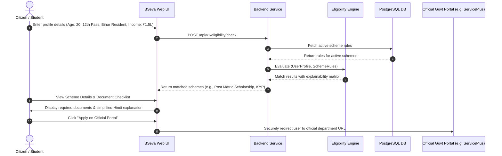

# High-Level Design (HLD) — Bihar Sahayak (BSeva) 🇮🇳
**AI-Powered Government Scheme & Career Intelligence Platform for Bihar**

---

## 1. Executive Summary & Objective

**Bihar Sahayak (BSeva)** is a discovery and intelligence layer designed to eliminate information asymmetry for citizens, students, job seekers, farmers, and women entrepreneurs across Bihar. The platform connects citizens with verified state and central government opportunities without acting as a replacement for official portals.

### Core Product Tenets:
- **Hindi-First & Simple UX:** Minimal administrative friction and intuitive language explanations.
- **Deterministic Rule Engine First:** Eligibility is computed via verifiable deterministic logic, not AI hallucinations.
- **Grounded AI Guidance (RAG):** AI Assistant exclusively cites official sources and departmental portals.
- **Privacy by Design:** Strict data-minimization (no collection of Aadhaar or banking credentials during discovery).

---

## 2. High-Level Architecture Overview

```mermaid
graph TD
    subgraph Client Layer
        A1[Web Browser / Mobile PWA - React + Vite + Tailwind]
    end

    subgraph Gateway & Security Layer
        B1[Cloudflare / Reverse Proxy CDN]
        B2[API Gateway / Rate Limiter / Helmet / CORS]
    end

    subgraph Core Application Layer (Backend API)
        C1[Auth & RBAC Service]
        C2[Citizen Profile Service]
        C3[Scheme Intelligence Engine]
        C4[Deterministic Eligibility Rule Engine]
        C5[Career Intelligence Engine]
        C6[Document Checklist Generator]
        C7[Admin & Audit Logging Service]
    end

    subgraph Intelligence & AI Layer
        D1[FastAPI AI Service / RAG Pipeline]
        D2[Vector Store: pgvector / ChromaDB]
        D3[LLM Gateway / Embeddings: Gemini / IndicLLM]
    end

    subgraph Data & Storage Layer
        E1[(PostgreSQL Primary DB)]
        E2[(Redis Cache & Session Store)]
        E3[(Object Storage / S3: Scheme PDFs & Docs)]
    end

    subgraph External Ecosystem
        F1[Official Bihar Govt Portals (ServicePlus, DBT, BSDM)]
    end

    A1 -->|HTTPS / JSON API| B1
    B1 --> B2
    B2 --> C1 & C2 & C3 & C4 & C5 & C6 & C7
    C3 & C4 & C5 --> E1
    C1 --> E2
    C3 & C4 -->|Context Enrichment| D1
    D1 --> D2 & D3
    C3 -->|External Portal Redirection| F1
```

---

## 3. Modular System Decomposition

### 3.1 Citizen Profile Module
- Captures minimal demographic parameters: `District`, `Block`, `Age`, `Gender`, `Social Category` (General, OBC, EBC, SC, ST), `Education Level`, `Occupation`, `Annual Family Income`, `Land Holding Size`, `Skills`, and `Interests`.
- Generates anonymous profile snapshots for quick guest eligibility checks without mandatory registration.

### 3.2 Scheme Intelligence Engine
- Central repository of indexed and verified Bihar government schemes and central sponsored schemes active in Bihar.
- Stores multilingual titles, descriptions, benefits, step-by-step application procedures, required documents, and official portal links.
- Tracks verification lifecycle: `DRAFT` $\to$ `VERIFIED` $\to$ `ACTIVE` $\to$ `DEPRECATED`.

### 3.3 Deterministic Eligibility Rule Engine
- Evaluates citizen profiles against scheme criteria using boolean expressions (`AND`, `OR`, `NOT`) and relational conditions (`GREATER_THAN`, `LESS_THAN_OR_EQUAL`, `EQUALS`, `IN`).
- Returns graded output:
  1. **Potentially Eligible** (All mandatory criteria satisfied)
  2. **Likely Not Eligible** (One or more rigid criteria failed, e.g., age or income limit exceeded)
  3. **Needs Verification** (Missing specific user attributes like specific certificate or category)
- Provides **Explainable Eligibility Breakdown** showing exactly which conditions passed and which failed.

### 3.4 Career Intelligence Engine
- Bridges education and employment schemes.
- Analyzes student/job-seeker profiles against career pathways (e.g., IT, Agribusiness, Government Services, Solar Technician, Handloom/Textile, Civil Services).
- Identifies skill gaps and maps them directly to Bihar Skill Development Mission (BSDM) programs and government-subsidized vocational courses.

### 3.5 Grounded AI & RAG Assistant
- Conversational interface supporting Hindi, Hinglish, and English.
- Retrieves chunked, verified government notifications from vector store.
- Enforces strict AI Safety: Prompts explicitly forbid hallucinating dates, monetary benefits, or links. Citations to official government sources are mandatory on all responses.

### 3.6 Admin & Verification Module
- Role-Based Access Control (RBAC): `CITIZEN`, `DATA_VERIFIER`, `ANALYST`, `ADMIN`, `SUPER_ADMIN`.
- Scheme curation workflow with mandatory `sourceUrl`, `department`, `lastVerifiedDate`, and `verifiedBy` auditing.
- Complete immutable audit logging (`audit_logs`) tracking changes across all entities.

---

## 4. End-to-End User Journey



---

## 5. Security, Reliability & Compliance

| Domain | Strategy & Implementation |
|---|---|
| **Authentication** | JWT stored in secure, `SameSite=Strict`, `HttpOnly` cookies. Refresh token rotation. |
| **Data Privacy** | Zero collection of Aadhaar, PAN, or Bank account numbers during discovery. |
| **AI Safety & Grounding** | Vector similarity threshold $\ge 0.75$; system prompts mandate official citation fallback on uncertainty. |
| **Auditability** | Every scheme modification records `old_value`, `new_value`, `admin_id`, and `timestamp`. |
| **Performance** | Caching scheme catalogs in Redis with 1-hour TTL; sub-50ms deterministic rule evaluation. |
