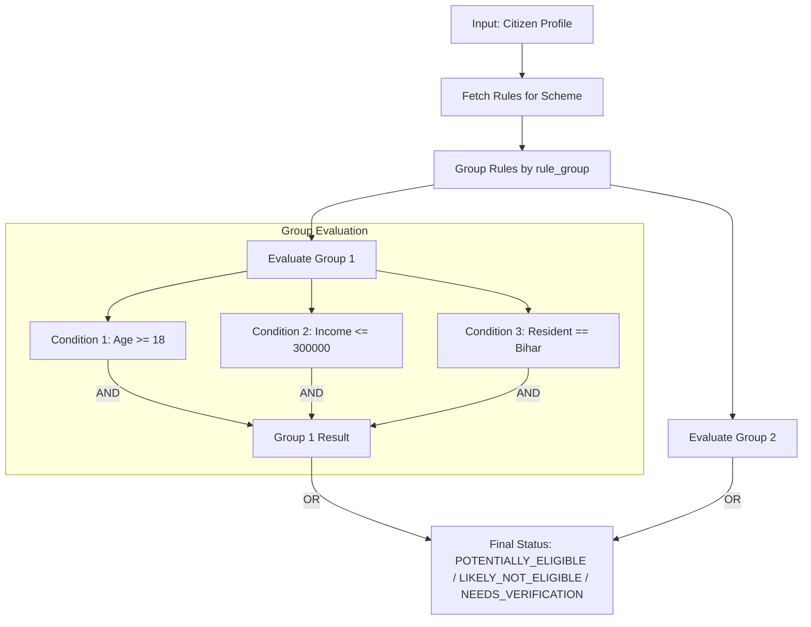

# Low-Level Design (LLD) — Bihar Sahayak (BSeva) 🇮🇳
**Detailed Component Architecture, Database Schemas & Rule Engine Logic**

---

## 1. Relational Database Schema (PostgreSQL DDL)

```sql
-- Enable UUID extension
CREATE EXTENSION IF NOT EXISTS "uuid-ossp";

-- 1. Roles & Users
CREATE TYPE user_role AS ENUM ('CITIZEN', 'DATA_VERIFIER', 'ANALYST', 'ADMIN', 'SUPER_ADMIN');
CREATE TYPE user_status AS ENUM ('ACTIVE', 'INACTIVE', 'SUSPENDED');

CREATE TABLE users (
    id UUID PRIMARY KEY DEFAULT uuid_generate_v4(),
    full_name VARCHAR(120) NOT NULL,
    email VARCHAR(255) UNIQUE,
    phone VARCHAR(20) UNIQUE,
    password_hash VARCHAR(255) NOT NULL,
    role user_role DEFAULT 'CITIZEN' NOT NULL,
    status user_status DEFAULT 'ACTIVE' NOT NULL,
    created_at TIMESTAMP WITH TIME ZONE DEFAULT CURRENT_TIMESTAMP NOT NULL,
    updated_at TIMESTAMP WITH TIME ZONE DEFAULT CURRENT_TIMESTAMP NOT NULL
);

-- 2. Citizen Profile
CREATE TYPE gender_type AS ENUM ('MALE', 'FEMALE', 'OTHER', 'ALL');
CREATE TYPE social_category AS ENUM ('GENERAL', 'OBC', 'EBC', 'SC', 'ST', 'EWS', 'ALL');
CREATE TYPE education_level AS ENUM (
    'BELOW_10TH', '10TH_PASS', '12TH_PASS', 'DIPLOMA', 
    'GRADUATE', 'POST_GRADUATE', 'DOCTORATE', 'VOCATIONAL'
);

CREATE TABLE citizen_profiles (
    id UUID PRIMARY KEY DEFAULT uuid_generate_v4(),
    user_id UUID UNIQUE REFERENCES users(id) ON DELETE CASCADE,
    district VARCHAR(60) NOT NULL,
    block VARCHAR(60),
    age INT NOT NULL,
    gender gender_type NOT NULL,
    social_category social_category DEFAULT 'GENERAL',
    is_bihar_resident BOOLEAN DEFAULT TRUE NOT NULL,
    education education_level NOT NULL,
    occupation VARCHAR(80),
    annual_income NUMERIC(12, 2) NOT NULL DEFAULT 0.00,
    land_holding_acres NUMERIC(6, 2) DEFAULT 0.00,
    is_differently_abled BOOLEAN DEFAULT FALSE,
    skills TEXT[] DEFAULT '{}',
    interests TEXT[] DEFAULT '{}',
    created_at TIMESTAMP WITH TIME ZONE DEFAULT CURRENT_TIMESTAMP NOT NULL,
    updated_at TIMESTAMP WITH TIME ZONE DEFAULT CURRENT_TIMESTAMP NOT NULL
);

-- 3. Departments & Scheme Taxonomy
CREATE TABLE departments (
    id UUID PRIMARY KEY DEFAULT uuid_generate_v4(),
    code VARCHAR(30) UNIQUE NOT NULL,
    name_en VARCHAR(200) NOT NULL,
    name_hi VARCHAR(200) NOT NULL,
    portal_url VARCHAR(500) NOT NULL,
    contact_email VARCHAR(100),
    contact_phone VARCHAR(50),
    created_at TIMESTAMP WITH TIME ZONE DEFAULT CURRENT_TIMESTAMP NOT NULL
);

CREATE TABLE scheme_categories (
    id UUID PRIMARY KEY DEFAULT uuid_generate_v4(),
    slug VARCHAR(60) UNIQUE NOT NULL,
    name_en VARCHAR(100) NOT NULL,
    name_hi VARCHAR(100) NOT NULL,
    icon VARCHAR(100),
    description TEXT,
    created_at TIMESTAMP WITH TIME ZONE DEFAULT CURRENT_TIMESTAMP NOT NULL
);

-- 4. Schemes Engine
CREATE TYPE scheme_status AS ENUM ('DRAFT', 'UNDER_REVIEW', 'ACTIVE', 'INACTIVE', 'DEPRECATED');
CREATE TYPE application_mode AS ENUM ('ONLINE', 'OFFLINE', 'HYBRID');

CREATE TABLE schemes (
    id UUID PRIMARY KEY DEFAULT uuid_generate_v4(),
    slug VARCHAR(120) UNIQUE NOT NULL,
    department_id UUID REFERENCES departments(id) ON DELETE RESTRICT NOT NULL,
    category_id UUID REFERENCES scheme_categories(id) ON DELETE RESTRICT NOT NULL,
    title_en VARCHAR(300) NOT NULL,
    title_hi VARCHAR(300) NOT NULL,
    description_en TEXT NOT NULL,
    description_hi TEXT NOT NULL,
    benefits_en TEXT NOT NULL,
    benefits_hi TEXT NOT NULL,
    application_mode application_mode DEFAULT 'ONLINE' NOT NULL,
    official_portal_url VARCHAR(500) NOT NULL,
    official_guideline_url VARCHAR(500),
    status scheme_status DEFAULT 'ACTIVE' NOT NULL,
    last_verified_date DATE NOT NULL,
    verified_by UUID REFERENCES users(id),
    version VARCHAR(20) DEFAULT '1.0' NOT NULL,
    created_at TIMESTAMP WITH TIME ZONE DEFAULT CURRENT_TIMESTAMP NOT NULL,
    updated_at TIMESTAMP WITH TIME ZONE DEFAULT CURRENT_TIMESTAMP NOT NULL
);

-- 5. Deterministic Eligibility Rules Table
CREATE TYPE rule_operator AS ENUM (
    'EQUALS', 'NOT_EQUALS', 'GREATER_THAN', 'GREATER_THAN_OR_EQUAL', 
    'LESS_THAN', 'LESS_THAN_OR_EQUAL', 'IN', 'NOT_IN', 'CONTAINS'
);

CREATE TABLE eligibility_rules (
    id UUID PRIMARY KEY DEFAULT uuid_generate_v4(),
    scheme_id UUID REFERENCES schemes(id) ON DELETE CASCADE NOT NULL,
    rule_group INT DEFAULT 1 NOT NULL, -- Grouping for OR logic
    field_name VARCHAR(60) NOT NULL,   -- e.g., 'age', 'annual_income', 'is_bihar_resident'
    operator rule_operator NOT NULL,
    rule_value JSONB NOT NULL,         -- e.g., "18", "300000", "[\"SC\", \"ST\"]"
    is_mandatory BOOLEAN DEFAULT TRUE,
    error_message_hi VARCHAR(255),
    error_message_en VARCHAR(255),
    created_at TIMESTAMP WITH TIME ZONE DEFAULT CURRENT_TIMESTAMP NOT NULL
);

-- 6. Documents & Scheme Mapping
CREATE TABLE documents (
    id UUID PRIMARY KEY DEFAULT uuid_generate_v4(),
    code VARCHAR(60) UNIQUE NOT NULL,
    name_en VARCHAR(200) NOT NULL,
    name_hi VARCHAR(200) NOT NULL,
    issuing_authority_en VARCHAR(200),
    issuing_authority_hi VARCHAR(200),
    description TEXT,
    created_at TIMESTAMP WITH TIME ZONE DEFAULT CURRENT_TIMESTAMP NOT NULL
);

CREATE TABLE scheme_documents (
    id UUID PRIMARY KEY DEFAULT uuid_generate_v4(),
    scheme_id UUID REFERENCES schemes(id) ON DELETE CASCADE NOT NULL,
    document_id UUID REFERENCES documents(id) ON DELETE RESTRICT NOT NULL,
    is_mandatory BOOLEAN DEFAULT TRUE NOT NULL,
    condition_description TEXT,
    UNIQUE(scheme_id, document_id)
);

-- 7. Career Intelligence
CREATE TABLE career_paths (
    id UUID PRIMARY KEY DEFAULT uuid_generate_v4(),
    slug VARCHAR(100) UNIQUE NOT NULL,
    title_en VARCHAR(200) NOT NULL,
    title_hi VARCHAR(200) NOT NULL,
    industry VARCHAR(100) NOT NULL,
    min_education education_level NOT NULL,
    avg_starting_salary_inr NUMERIC(10, 2),
    growth_prospects VARCHAR(50),
    description_en TEXT,
    description_hi TEXT,
    created_at TIMESTAMP WITH TIME ZONE DEFAULT CURRENT_TIMESTAMP NOT NULL
);

CREATE TABLE skills (
    id UUID PRIMARY KEY DEFAULT uuid_generate_v4(),
    name VARCHAR(100) UNIQUE NOT NULL,
    category VARCHAR(80) NOT NULL,
    description TEXT
);

CREATE TABLE career_skills (
    career_id UUID REFERENCES career_paths(id) ON DELETE CASCADE,
    skill_id UUID REFERENCES skills(id) ON DELETE CASCADE,
    importance_weight NUMERIC(3, 2) DEFAULT 1.0,
    PRIMARY KEY(career_id, skill_id)
);

-- 8. Eligibility Checks & Audit Logging
CREATE TABLE eligibility_check_logs (
    id UUID PRIMARY KEY DEFAULT uuid_generate_v4(),
    user_id UUID REFERENCES users(id) ON DELETE SET NULL,
    scheme_id UUID REFERENCES schemes(id) ON DELETE CASCADE NOT NULL,
    result VARCHAR(30) NOT NULL, -- POTENTIALLY_ELIGIBLE, NOT_ELIGIBLE, NEEDS_VERIFICATION
    matched_conditions JSONB,
    failed_conditions JSONB,
    created_at TIMESTAMP WITH TIME ZONE DEFAULT CURRENT_TIMESTAMP NOT NULL
);

CREATE TABLE audit_logs (
    id UUID PRIMARY KEY DEFAULT uuid_generate_v4(),
    actor_id UUID REFERENCES users(id) ON DELETE SET NULL,
    action VARCHAR(100) NOT NULL, -- e.g., 'SCHEME_VERIFIED', 'RULE_UPDATED'
    entity_name VARCHAR(60) NOT NULL,
    entity_id UUID NOT NULL,
    old_value JSONB,
    new_value JSONB,
    ip_address VARCHAR(45),
    user_agent TEXT,
    created_at TIMESTAMP WITH TIME ZONE DEFAULT CURRENT_TIMESTAMP NOT NULL
);
```

---

## 2. Deterministic Eligibility Rule Engine Specification

### 2.1 Abstract Syntax Tree (AST) Rule Evaluation Model

Every scheme is evaluated through groups of logical rules.
- **Rules within the same `rule_group` are combined with logical `AND`.**
- **Different `rule_group`s for the same scheme are combined with logical `OR`.**

```
Scheme Eligibility = (Group_1_Rule_A AND Group_1_Rule_B) OR (Group_2_Rule_A AND Group_2_Rule_C)
```



### 2.2 Relational Operators Handler

```typescript
export function evaluateCondition(fieldValue: any, operator: string, ruleValue: any): boolean {
  if (fieldValue === undefined || fieldValue === null) return false;

  switch (operator) {
    case 'EQUALS':
      return String(fieldValue).toUpperCase() === String(ruleValue).toUpperCase();
    case 'NOT_EQUALS':
      return String(fieldValue).toUpperCase() !== String(ruleValue).toUpperCase();
    case 'GREATER_THAN':
      return Number(fieldValue) > Number(ruleValue);
    case 'GREATER_THAN_OR_EQUAL':
      return Number(fieldValue) >= Number(ruleValue);
    case 'LESS_THAN':
      return Number(fieldValue) < Number(ruleValue);
    case 'LESS_THAN_OR_EQUAL':
      return Number(fieldValue) <= Number(ruleValue);
    case 'IN':
      return Array.isArray(ruleValue) && ruleValue.map(v => String(v).toUpperCase()).includes(String(fieldValue).toUpperCase());
    case 'NOT_IN':
      return Array.isArray(ruleValue) && !ruleValue.map(v => String(v).toUpperCase()).includes(String(fieldValue).toUpperCase());
    case 'CONTAINS':
      return Array.isArray(fieldValue) && fieldValue.includes(ruleValue);
    default:
      return false;
  }
}
```

---

## 3. Career Recommendation Scoring Model

The Career Intelligence Engine matches a citizen's profile using cosine/jaccard hybrid weighting:

$$\text{Career Match Score} = (0.35 \times \text{Education Fit}) + (0.45 \times \text{Skill Overlap}) + (0.20 \times \text{Interest Alignment})$$

1. **Education Fit:** 100% if `user.education >= career.min_education`, scaled down if below requirement.
2. **Skill Overlap:** $\frac{|\text{User Skills} \cap \text{Career Skills}|}{|\text{Career Skills}|} \times 100$.
3. **Skill Gap Output:** Returns the difference vector $\text{Missing Skills} = \text{Career Skills} \setminus \text{User Skills}$ mapped to corresponding Bihar Skill Development Mission (BSDM) courses.
